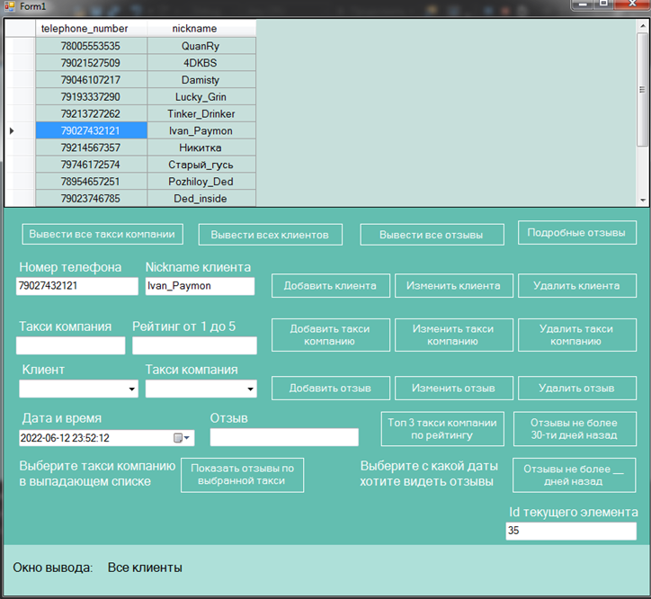
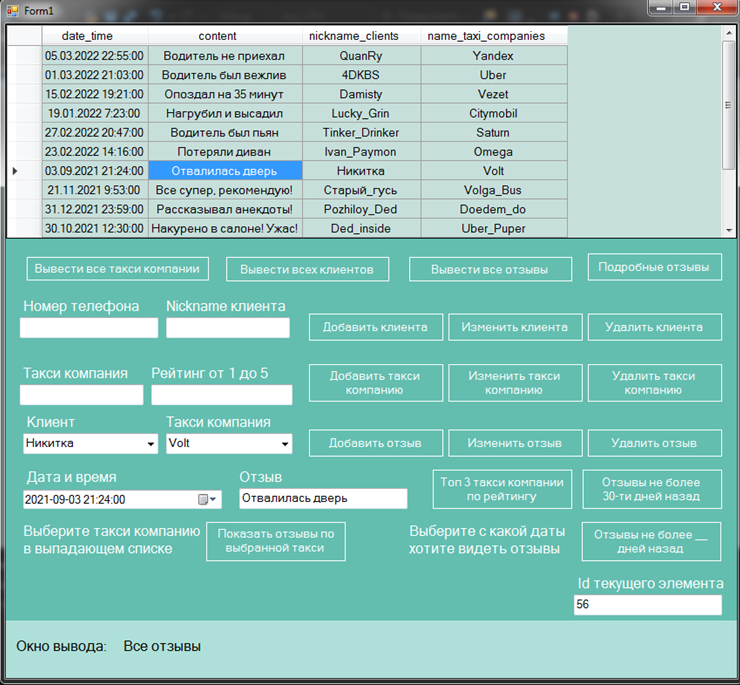
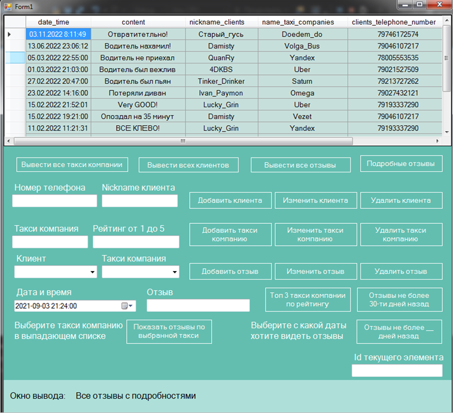

# Репозиторий дисциплины "Базы данных"

<h2 align="center">
  :money_with_wings: Desktop-приложение для заказа поездки на такси :taxi:
</h2>

---

### Цели:

В данном репозитории хранится Desktop-приложение для заказа поездки на такси, сделанное с помощью C#, в Visual Studio 2019 
(с использованием Windows Forms, для разработки GUI приложения) с библиотекой, с использованием пакетов – NuGet (MySQL.Data версии 8.0.29 от автора: Oracle),
для подключения к БД, разработанной ранее на лабораторных работах, также были использованы библиотека System.

---

### Кому может быть полезно?

:white_check_mark: **Такси-компаниям**  
Для анализа статистики по поездкам, оптимизации маршрутов, оценки водителей и управления автопарком.

:white_check_mark: **Диспетчерам**  
Для управления заказами, распределения водителей и оперативного контроля за поездками.

:white_check_mark: **Руководителям автопарков**  
Для отслеживания состояния автомобилей, их загруженности и необходимости в техническом обслуживании.

:white_check_mark: **Водителям**  
Для получения обратной связи по своим поездкам и повышения качества обслуживания.

:white_check_mark: **Клиентам**  
Для оценки водителей и автомобилей, а также проверки истории своих поездок и отзывов.

:white_check_mark: **Аналитикам**  
Для анализа данных о поездках, водителях и клиентах, а также построения прогнозов для повышения прибыли.

:white_check_mark: **Разработчикам программного обеспечения**  
Для интеграции данных о поездках и компаниях в другие системы или разработки новых приложений на основе данных.

:white_check_mark: **Службам контроля качества**  
Для анализа отзывов, выявления проблемных зон и повышения общего уровня обслуживания.

---

### Проектирование БД

Прежде чем приступать к реализации приложения и созданию БД, нам необходимо продумать какие таблицы с какими колонками будут присутствовать в нашей БД.

#### Список атрибутов

#### Клиент
- **номер телефона**  
- **nickname**  

#### Способ оплаты
- **стоимость**  
- **наименование**  

#### Способ заказа поездки
- **наименование**  

#### Дополнительная опция
- **наименование**  

#### Адрес
- **адрес прибытия**  
- **адрес отправления**  

#### Фирма такси
- **оценка**  
- **наименование**  

#### Отзывы
- **дата**  
- **nickname пользователя**  
- **содержание**  

#### Таксист
- **оценка**  
- **стаж вождения**  
- **nickname**  

#### Машина
- **цвет**  
- **фирма**  
- **название**  
- **номер**  

#### Класс
- **наименование**  

### ERD диаграмма

ERD-диаграмма полученная, при проектирвоании нашей БД такси-компаний и информации на них.

  
  
 Рисунок 1 – ERDдиаграмма БД 
 

---

Переход от ERD диаграммы к реляционной модели заключается в преобразовании концептуальной структуры базы данных в физическую, пригодную для реализации в реляционной СУБД. На этом этапе сущности ERD-диаграммы преобразуются в таблицы, а атрибуты сущностей становятся их столбцами. Для каждой таблицы определяется первичный ключ, обеспечивающий уникальность записей, а связи между сущностями реализуются с помощью внешних ключей. Если в диаграмме присутствуют сложные связи, такие как "многие ко многим", создаются дополнительные таблицы для их реализации. Этот процесс позволяет структурировать данные в соответствии с принципами реляционной модели, обеспечивая их целостность и логическую согласованность.

### Реляционная диаграмма

  
  
 Рисунок 2 – Реляционная диаграмма БД 
 

---

### Диаграмма, построенная автоматически в СУБД MySQL Workbench 

После проектирования БД и переноса в MySQL была создана следующая схема связей в MySQL Workbench.

  
  
 Рисунок 3 – Диаграмма, полученная в MySQL, после создания всей структуры БД 
 

---

### Внешний вид и работа получившегося desktop-приложения

Далее представлены внешний вид десктопной версии приложения и основные функциональные возможности.

  
  
 Рисунок 4 – Стартовое окно desktop-приложения 
 

  
  
 Рисунок 5 – Отображение всех клиентов 
 

  
  
 Рисунок 6 – Отображение всех комментов 
 

Пользователь также может просмотреть подробные отзывы, напрмиер в информации будет не только клиент, таксист и маршрут, но и информация о клиенте, таксисте, отзыве, который клиент оставит.
Данный запрос в БД и вывод его отдельной кнопкой очень упростит жизнь какому-нибудь диспетчеру, который по одной кнопке и кнопкам фильтрации сможет быстро разобраться в поездках.

  
  
 Рисунок 7 – Отображение подробных отзывов 
 

Помимо представленных функций есть еще и функции CRUD, т.е. базовые функции для подобных приложений с БД, а также много другое, 
с чем подробнее вы сможете познакомиться в  [документации](https://github.com/QuanRy/DataBase/blob/main/LAB_7_DB_V2/ПОЯСНИТЕЛЬНАЯ%20НА%20КУРСОВУЮ.doc)

---

<h2 align="center">
  :gift_heart: Желаем успехов! :gift_heart:
  
  :stuck_out_tongue_winking_eye: Чтобы следить за новыми проектами - :bell: подпишись на [меня](https://github.com/QuanRy) :bell: :stuck_out_tongue_winking_eye:
</h2>
